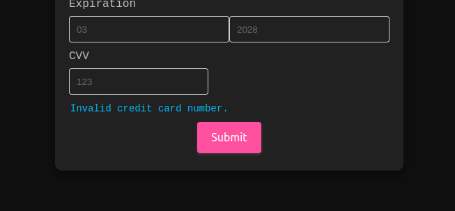

# Credit Card Validator with Wishlist Cart

This is a web application project that allows users to validate credit cards using the Luhn algorithm. Additionally, it provides functionality to simulate a wishlist cart for sending gifts. If the credit card is valid, the gift will be successfully sent, but if the card is not valid, the transaction will be rejected.

## Users

This application primarily targets users who want to send a gift and are required to provide valid credit card information to complete the transaction.

## How to use

Entering Credit Card Information:
Users can input credit card information (up to 16 characters) without spaces or special characters.

Validation:
The application employs the Luhn algorithm for credit card validation. If the card is valid, the gift will be sent successfully.

### Technologies Used

`Vanilla JavaScript` 
`HTML`
`CSS`
`Git`
`GitHub`

## Screenshots

Here are some screenshots of the application:

This screenshot displays the entered data and demonstrates how the credit card numbers are masked.

In this screenshot, you can see a success message indicating that a valid credit card number was entered.

This screenshot showcases an error message indicating that an invalid credit card number was entered.

### Descripción de scripts / archivos

* `index.html`: this is the entry point of the application.
* `style.css`: contains the style rules for the application.
* `validator.js`: this file implements the `validator` object, which includes the methods`isValid`, that validates the credit card numbers, using the Luhn algorithm, and `maskify`, wich masks the last four credit card numbers.
* `index.js`:  listens to DOM events, invokes validator.isValid() and validator.maskify() as needed, and updates the UI accordingly.
* `test/validator.spec.js`: Contains example tests for the application.